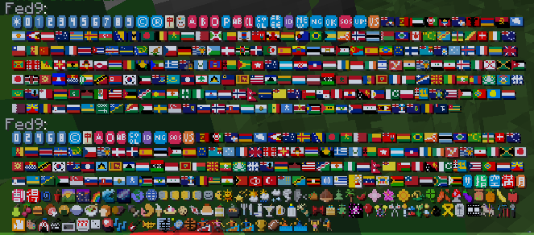
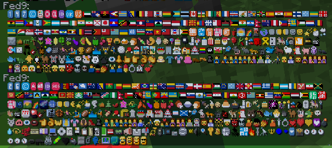
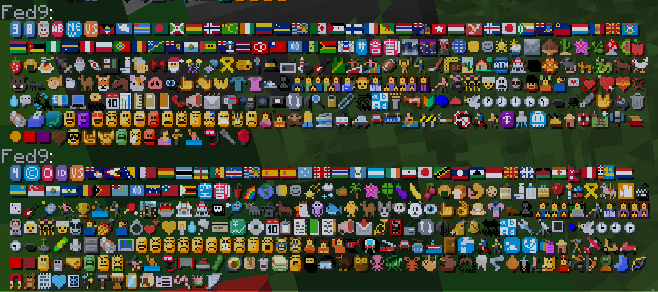

# SerenityOS emoji pack for Oraxen

[](https://github.com/ploxxxy/serenity-emojis/releases/latest) [](https://emoji.serenityos.net/)

This script generates more than 1,700 emoji glyphs for your Minecraft server using [Oraxen](https://www.spigotmc.org/resources/%E2%98%84%EF%B8%8F-oraxen-custom-items-blocks-emotes-furniture-resourcepack-and-gui-1-18-1-21.72448/), thanks to [SerenityOS](https://serenityos.org/) and [Are we emoji yet?](https://emoji.serenityos.net/) website.

### Some of the emojis in-game, in no particular order




## Building the pack yourself
Using [Deno](https://docs.deno.com/runtime/manual#install-deno) (version 1.44.4 used):
```sh
# Run inside of the project folder

deno task start

mv output/* path_to_your_server/plugins/Oraxen
```
